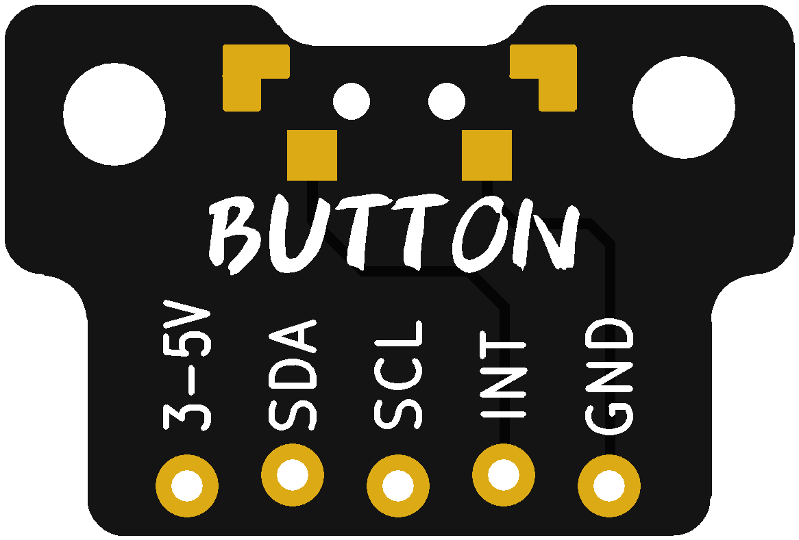
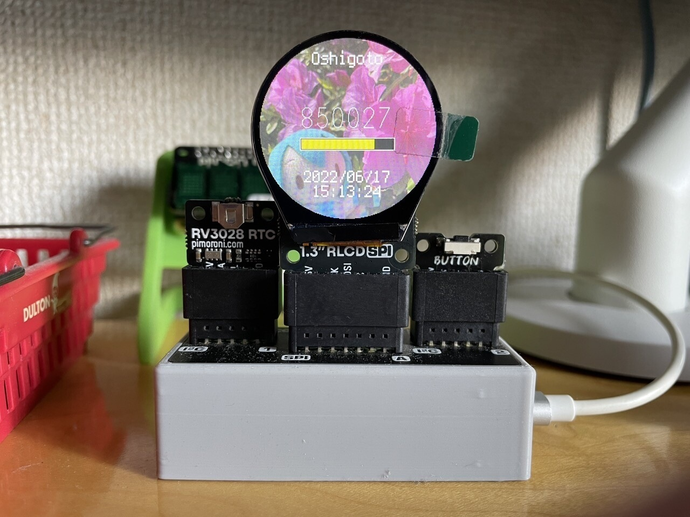

# BG-Button

[Pimoroni Breakout Garden](https://shop.pimoroni.com/collections/breakout-garden)で使用できるボタンブレイクアウト基板です。INTピンに配線されており、Raspberry Piの場合はBCM4、Raspberry Pi Picoの場合はGP3に接続されます。

## 制作環境

KiCad (6.0)

## 組み立て

ボタンは[TS-B001](https://jaliexpress.com/item/4001013178307.html) 3x3.6x3.5を使用します。

